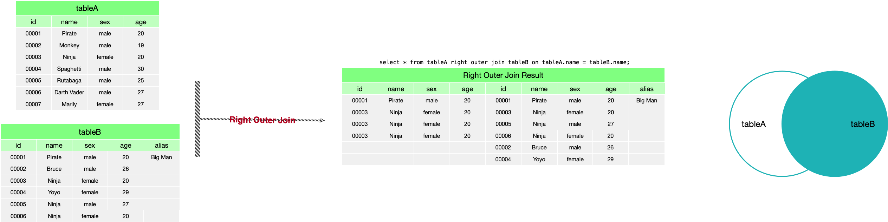

# SQL Join

连接（Join）作用于两个表，并产生一个表作为结果，它将一个表中的每行与第二个表中的所有行都进行连接。

假设有以下两个表。


## Natural Join

> Natural Join 考虑那些在两个表中都出现的字段上取值相同的行。

```SQL
select * from tableA natural join tableB;
```


## Inner Join

> Inner Join 考虑那些在两个表中都符合特定条件的行。特定条件使用 `on` 指定。

```SQL
select * from tableA inner join tableB on tableA.columnA = tableB.columnB;
```


## Full Outer Join

> Full Outer Join 考虑那些在左表和右表都出现的行，没有匹配的话，以 `null` 代替。

```SQL
select * from tableA full outer join tableB on tableA.columnA = tableB.columnB;

-- MySQL 不支持 full outer join，使用以下方法可以实现 full outer join
select * from tableB left outer join tableA on tableA.name = tableB.name
union
select * from tableB right outer join tableA on tableA.name = tableB.name;
```


## Left/Right Outer Join

> Left Outer Join 考虑左表中的全部行，和右表中与左表匹配的行，如果没有匹配的话，以 `null` 代替。
>
> Right Outer Join 考虑右表中的全部行，和左表中与右表匹配的行，如果没有匹配的话，以 `null` 代替。

```SQL
select * from tableA left outer join tableB on tableA.columnA = tableB.columnB;

select * from tableA right outer join tableB on tableA.columnA = tableB.columnB;
```

Left outer join example:


Right outer join exmalpe:

